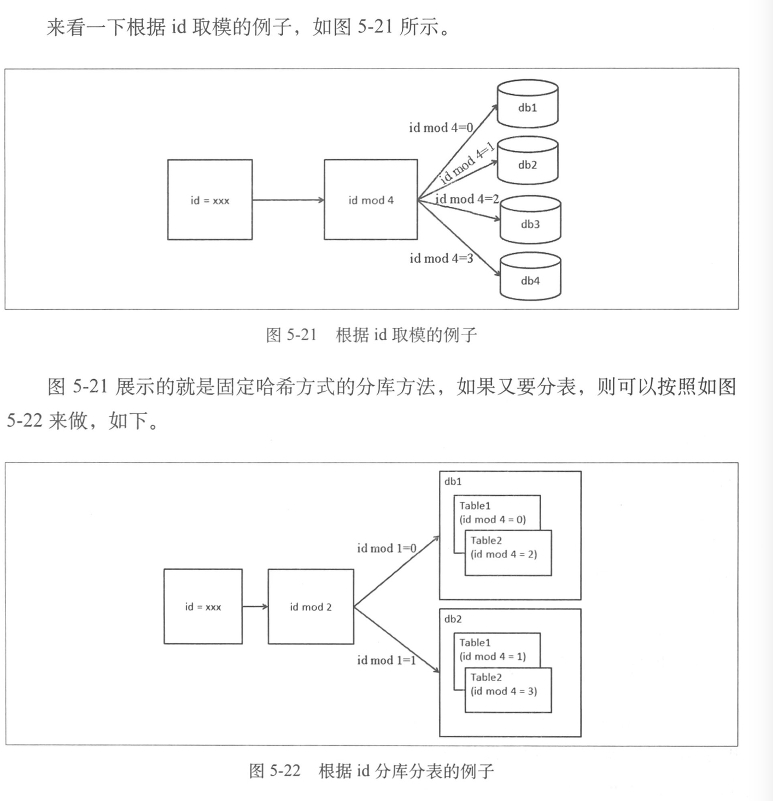
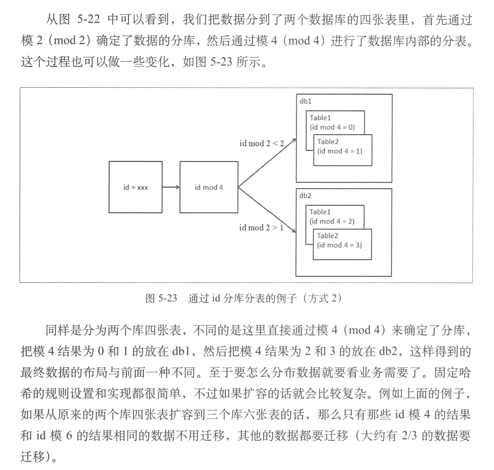

## 数据访问层

### 数据库从单机到分布式

在不靠硬件升级的情况下，能够想到的方案就是给现有数据库减压，减压思路有三个，一是优化应用，看看是否有不必要的压力给了数据库（应用优化），二是有没有其他办法可以降低对数据库的压力，例如引入缓存，加搜索引擎等，三是把数据库的数据和访问分到多台数据库上，分开支持，这也是我们的核心思路和逻辑

数据库拆分有两种方式，垂直拆分和水平拆分。垂直拆分是把一个数据库中不同业务单元的数据分到不同数据库里面，水平拆分是根据一定的规则把同一业务单元拆分到多个数据库中。

垂直拆分会带来的影响如下

-   单机的ACID保证被打破了，数据到了多机后，原来在单机通过事务来进行的处理逻辑会收受到很大的影响，我们面临的选择是，要么放弃原来的单机事务，修改实现，要么引入分布式事务
-   一些Join操作会变得比较困难，因为数据可能已经在两个数据库中了，所以不能很方便地利用数据库自身的Join了
-   靠外键进行约束的场景会受到影响

水平拆分会带来的影响

-   同样有可能ACID被打破的情况
-   同样有可能有Join操作被影响的情况
-   靠外键进行约束的场景会有影响
-   依赖单库的自增序列生成唯一ID会受影响
-   针对单个逻辑意义上的表的查询要跨库了

这些只是一小部分，例如原来的一些存储过程，触发器等也需要改写才能完成相应的工作。

### 分布式事务

分布式事务模型，X/Open DTP 模型

-   Application Program(AP)， 即应用程序，可以理解为实用DTP模型的程序，它定义了事务的边界，并定义了构成该事务的应用程序特定操作。
-   Resource Manager(RM)，资源管理器，可以理解为一个DBMS系统，或者消息服务管理系统。应用程序通过资源管理器对资源进行控制，资源管理器提供了存储共享资源的支持。
-   Transaction Manager(TM)，事务管理器，负责协调和管理事务，提供给AP应用程序编程接口并管理资源管理器。TM向事务指定标识，监视它们的进程，负责处理事务的完成和失败。

在分布式系统中，两台机器理论上无法达到一致的状态，需要引入一个单点进行协调，事务管理器控制着全局事务，管理事务的生命周期，并协调资源

DTP中还有其他的一些概念

-   事务：一个事务是一个完整的工作单元，由多个独立的计算任务组成，这多个任务在逻辑上是原子的
-   全局事务：一次性操作多个资源管理器的事务就是全局事务
-   分支事务：在全局事务中，每一个资源管理器有自己独立的任务，这些任务的集合是这个资源管理器的分支任务。
-   控制线程：用来表示一个工作线程，主要是关联AP，TM，RM三者的线程，也就是事务上下文环境，即标识全局事务和分支事务关系的线程。

### 两阶段提交，2PC

成功的情况

失败的情况

### 大型网站一致性的基础理论 CAP

CAP理论

-   Consistency  所有的节点在同一时间读到同样的数据，这是数据上的一致性，用C表示，也就是当数据写入成功后，所有的节点会同时看到这个新的数据
-   Availability，保证无论是成功还是失败，每个请求都能收到一个反馈，这是数据的可用性，用A表示，这里重点是系统一定要有响应。
-   Partition-Tolerance，即便系统中有部分问题或消息的丢失，但是系统仍能够继续运行，这被称为分区容忍性，用P表示，也就是在系统的一部分出现问题时，系统仍能继续工作。

分布式系统不可能同时满足以上三点

-   选择CA，放弃分区容忍性，加强一致性和可用性，这其实就是传统单机数据库的选择
-   选择AP，放弃一致性，追求分区容忍性和可用性，这是很多分布式系统在设计时的选择，例如很多NoSQL系统
-   选择CP，放弃可用性，追求一致性和分区容忍性，这张选择下的可用性会比较低，网络问题会使整个系统不可用

贼分布式系统中，我们一般还是选择AP，然后如何解决C

-   Basically Available 基本可用，允许分区失败
-   Soft state 软状态，接受一段时间的状态不同步
-   Eventually consistent 最终一致，保证最终数据的状态是一致的

### 比两阶段提交更轻量一些的Paxos协议

Paxos协议，保证一致性的协议，核心原则是少数服从多数

### 多机Sequence问题与处理

分库分表后，自增不重复id成了一个难题。如果只考虑id的唯一性的话，那么可以参考UUID生成的方式。虽然保证了唯一性，但是在整个分布式系统中的连续性不好

连续性的实现方案，可以把所有的id集中放在一个地方进行管理，对每个id序列独立管理，每台机器使用id时都从这个id生成器上取，但是有以下几个问题要解决

-   性能问题，每次远程去取id会有资源损耗，一种改进的方案是一次取一段id，然后缓存在本地，这样就不需要每次去远程的生成器上取id，但也会带来一些问题，比如应用取了一段id，正在使用时宕机了，那么一些id号就浪费了
-   生成器的稳定性问题，id生成器作为一个无状态的集群存在，其可用性要靠整个集群来保证。
-   存储的问题

### 应对多机的数据库查询

跨库Join，1.把join操作分成多次数据库操作。2.数据冗余。3.借助外部系统（如搜索引擎）解决一些跨库的问题

外键约束，这个比较难解决，不能完全依赖数据库本身来完成之前的功能。

分库查询后的问题

-   排序
-   函数处理
-   求平均值
-   非排序分页
-   排序后分页，这是最复杂的情况

### 数据访问层的设计与实现

### 对比

虽然说基于ORM或类ORM接口的方式与数据库进行交互比JDBC直接进行交互方便很多，但是在某些场景下，如分库分表后排序分页的场景，我们要显示4条数据，其中从数据源1中获取第1，3，5，7条数据，从数据源2中获取2，4，6，8条数据，ORM会从数据库中返回并生成对应的对象，进行排序后丢弃4个不需要的对象。如果采用JDBC访问，那么我们只需要生成1，3和2，4这4个对象就行了。此处基于JDBC的优势就比较明显。

### 按照数据层流程的顺序看数据层设计

我们在执行数据库操作时大致是按照图中所示的几个步骤进行的

SQL解析 -> 规则处理 -> SQL改写 -> 数据源选择 -> SQL执行 -> 结果集返回合并处理

#### SQL解析阶段

主要考虑两个问题，一、对sql支持的程度，是否需要支持所有的sql。二、支持多少sql的方言，对于不同厂商超出标准SQL的部分要支持多少。进行sql解析时，对于解析的缓存可以提升解析速度。

#### 规则处理阶段

采用固定哈希算法作为规则，固定哈希方式为，根据某个字段（如用户id）取模，然后将数据分散到不同的数据库和表中。除了根据id取模，还经常会根据时间维度，如天、星期、月、年等来存储数据，这一般用于数据产生后相关日期不修改的情况，否则就要涉及数据移动的问题。

一致性哈希算法，把节点对应的哈希值变为了一个范围，不再是离散的。在一致性哈希中，我们会把整个哈希值的范围定义得非常大，然后把这个范围分配给现有的节点，如果有节点加入，那么新的节点会从原有的某个节点上分管一部分范围的哈希，比如说[0,25), [25,50),[50,75), [75,100]，当第二个节点退出，那么第三个节点管理第二个节点变成[0,25), [25,75), [75,100]。若二，三之间增加一个节点那么变成[0,25), [25,50), [50,63), [63,75), [75,100]，可以看到一、二、四个节点都没收到影响。

虚拟节点对一致性哈希的改进。上面的4个物理节点可以变为很多个虚拟节点，每个虚拟节点支持连续的哈希环上的一段，而这时如果加入一个物理节点，就会相应加入很多虚拟节点，这些新的虚拟节点是相对均匀地插入到整个哈希环山的，这样就可以很好地分担现有物理节点的压力。如果减少一个物理节点，对应的很多虚拟节点就会失效，这样，就会有很多剩余的虚拟节点来承担之前虚拟节点的工作，但是对于物理节点来说，增加的负载是均衡的。

#### 改写sql

如果设定规则，如何分库分表，一般的标准是分库后尽可能避免跨库查询

单表单库变为来多库多表，这些分布在不同数据库中的表的结构一样，但是表名未必一样，一般原来的表名为User，那么分库分表后的表名就可以命名为User\_1 , User\_2

除了修改表名，SQL的一些提示中用到的索引名等，在分库分表时也需要进行相应的修改，需要从逻辑上的名字变为对应数据库中的物理名字

在进行跨库计算平均值的时候，不能从多个数据源取平均值，在计算这些平均值的平均值，而必须修改sql获取到数量，总数后再进行计算

#### 数据源的选择

User经历了分库分表后，我们会给分库后的库都提供备库，也就是原来的一个数据库编委一个数据库的矩阵了。我们决定了数据分组后，还需要决定访问分组中的哪个库，这些库一般是一写多读的（也有多写多读的），根据当前要执行的SQL特点（读写），是否在事务中以及各个库的权重规则，计算得到这次SQL请求要访问的数据库。

#### 执行SQL和结果处理阶段

在sql执行的部分，比较重要的是对异常的处理和判断。

### 独立部署的数据访问层实现方式

应用 -> Proxy -> DB

### 读写分离的挑战和应对

1.主库从库非对称的场景，比如说主库使用的是oracl数据库，而从库比较多，使用oracl显然要付巨大的一笔费用，使用mysql是一个很好的选择，此时就不能基于Mysql的Replication来处理，比较优雅的方式是基于数据库的日志来进行数据的复制

2.主/备库分库方式不同的数据复制，一般情况下进行的是对称的复制，也就是镜像，但是也会有一些场景进行非对称复制，这里的非对称复制是指数据源河目标数据不是镜像关系，也指源数据库和目标数据库是不同的实现。

例如在主库中，我们根据买家id进行了分库，在备库中根据卖家id进行分库，此时完成这个非对称复制，需要控制数据的分发，而不是简单地进行镜像复制。

3.引入数据变更平台，引入Extractor 提取器，负责把数据源变更

### 如何做到数据的平滑迁移

对于没有状态的应用，扩容和索容是比较容易的，而对于数据库，扩容和缩容会涉及到数据的迁移。如果能接受完全停机的扩容或缩容，就比较容易处理，停机后进行数据迁移，校验，恢复系统就可以了，但是如果不能接受长时间停机，那该怎么办呢。

对数据库做平滑迁移的最大挑战是，在建议的过程中又会有数据变化。我们可以在开始进行数据迁移时，记录增量的日子，在迁移结束后，在对增量的变化进行处理，在最后，可以把要被迁移的数据的写暂停，保证增量日志都处理完毕，在切换规则，开发所有的写，完成迁移

1.确定开始扩容，并记录开始数据库的数据变更的增量日志

2.数据开始复制到新库表，并且也有更新进来

3.全量迁移结束后，我们把增量日志中的数据也进行迁移

4.然后我们进行数据对比，这时可能会有新库数据和源库数据不同的情况，把它们记录下来

5.我们停止源数据库中对要迁移走的数据的写操作，然后进行增量日志的处理，使得新库表的数据都是新的。

6.更新路由规则，所有新数据的读或写就到了新库表，完成整个迁移过程

