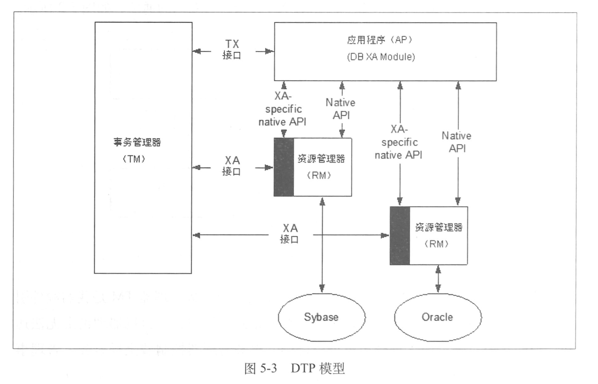
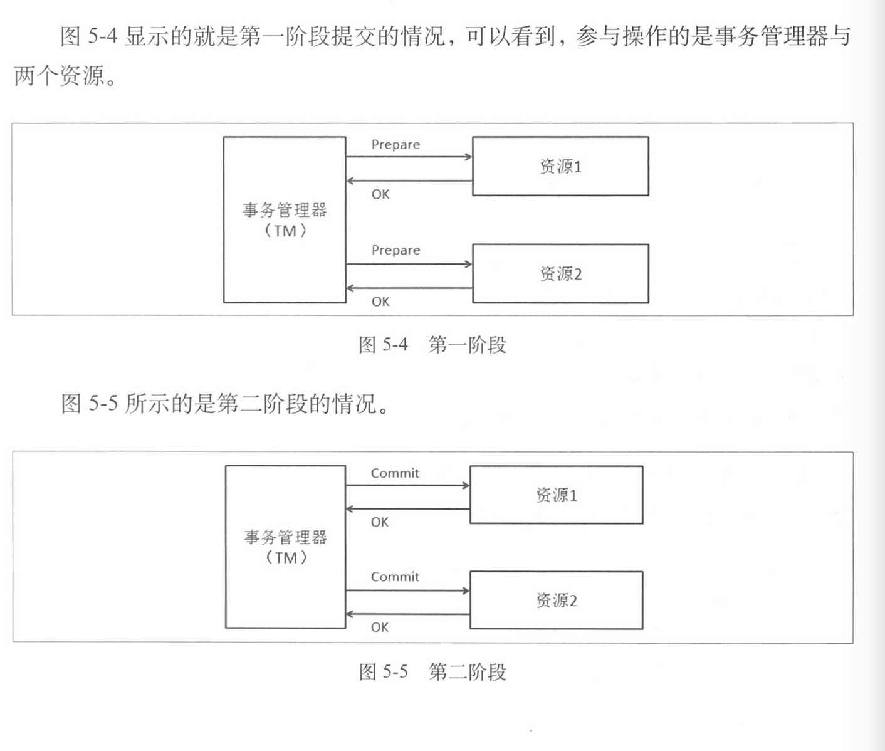
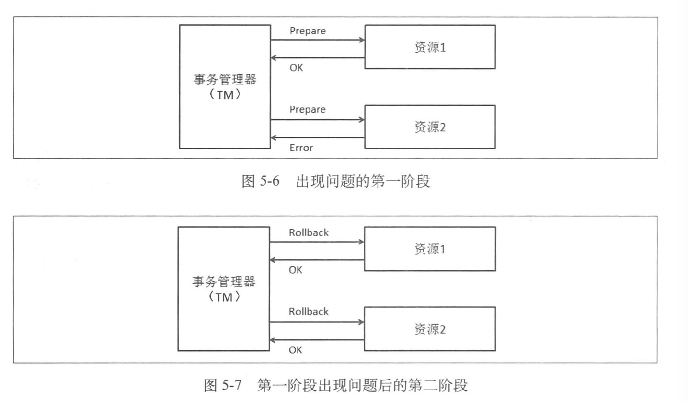

## 数据访问层

### 数据库从单机到分布式

在不靠硬件升级的情况下，能够想到的方案就是给现有数据库减压，减压思路有三个，一是优化应用，看看是否有不必要的压力给了数据库（应用优化），二是有没有其他办法可以降低对数据库的压力，例如引入缓存，加搜索引擎等，三是把数据库的数据和访问分到多台数据库上，分开支持，这也是我们的核心思路和逻辑

数据库拆分有两种方式，垂直拆分和水平拆分。垂直拆分是把一个数据库中不同业务单元的数据分到不同数据库里面，水平拆分是根据一定的规则把同一业务单元拆分到多个数据库中。

垂直拆分会带来的影响如下

-   单机的ACID保证被打破了，数据到了多机后，原来在单机通过事务来进行的处理逻辑会收受到很大的影响，我们面临的选择是，要么放弃原来的单机事务，修改实现，要么引入分布式事务
-   一些Join操作会变得比较困难，因为数据可能已经在两个数据库中了，所以不能很方便地利用数据库自身的Join了
-   靠外键进行约束的场景会受到影响

水平拆分会带来的影响

-   同样有可能ACID被打破的情况
-   同样有可能有Join操作被影响的情况
-   靠外键进行约束的场景会有影响
-   依赖单库的自增序列生成唯一ID会受影响
-   针对单个逻辑意义上的表的查询要跨库了

这些只是一小部分，例如原来的一些存储过程，触发器等也需要改写才能完成相应的工作。

### 分布式事务

分布式事务模型，X/Open DTP 模型

-   Application Program(AP)， 即应用程序，可以理解为实用DTP模型的程序，它定义了事务的边界，并定义了构成该事务的应用程序特定操作。
-   Resource Manager(RM)，资源管理器，可以理解为一个DBMS系统，或者消息服务管理系统。应用程序通过资源管理器对资源进行控制，资源管理器提供了存储共享资源的支持。
-   Transaction Manager(TM)，事务管理器，负责协调和管理事务，提供给AP应用程序编程接口并管理资源管理器。TM向事务指定标识，监视它们的进程，负责处理事务的完成和失败。

在分布式系统中，两台机器理论上无法达到一致的状态，需要引入一个单点进行协调，事务管理器控制着全局事务，管理事务的生命周期，并协调资源

DTP中还有其他的一些概念

-   事务：一个事务是一个完整的工作单元，由多个独立的计算任务组成，这多个任务在逻辑上是原子的
-   全局事务：一次性操作多个资源管理器的事务就是全局事务
-   分支事务：在全局事务中，每一个资源管理器有自己独立的任务，这些任务的集合是这个资源管理器的分支任务。
-   控制线程：用来表示一个工作线程，主要是关联AP，TM，RM三者的线程，也就是事务上下文环境，即标识全局事务和分支事务关系的线程。

### 两阶段提交，2PC

成功的情况

失败的情况

### 大型网站一致性的基础理论 CAP

CAP理论

-   Consistency  所有的节点在同一时间读到同样的数据，这是数据上的一致性，用C表示，也就是当数据写入成功后，所有的节点会同时看到这个新的数据
-   Availability，保证无论是成功还是失败，每个请求都能收到一个反馈，这是数据的可用性，用A表示，这里重点是系统一定要有响应。
-   Partition-Tolerance，即便系统中有部分问题或消息的丢失，但是系统仍能够继续运行，这被称为分区容忍性，用P表示，也就是在系统的一部分出现问题时，系统仍能继续工作。

分布式系统不可能同时满足以上三点

-   选择CA，放弃分区容忍性，加强一致性和可用性，这其实就是传统单机数据库的选择
-   选择AP，放弃一致性，追求分区容忍性和可用性，这是很多分布式系统在设计时的选择，例如很多NoSQL系统
-   选择CP，放弃可用性，追求一致性和分区容忍性，这张选择下的可用性会比较低，网络问题会使整个系统不可用

贼分布式系统中，我们一般还是选择AP，然后如何解决C

-   Basically Available 基本可用，允许分区失败
-   Soft state 软状态，接受一段时间的状态不同步
-   Eventually consistent 最终一致，保证最终数据的状态是一致的

### 比两阶段提交更轻量一些的Paxos协议

Paxos协议，保证一致性的协议，核心原则是少数服从多数

### 多机Sequence问题与处理

分库分表后，自增不重复id成了一个难题。如果只考虑id的唯一性的话，那么可以参考UUID生成的方式。虽然保证了唯一性，但是在整个分布式系统中的连续性不好

连续性的实现方案，可以把所有的id集中放在一个地方进行管理，对每个id序列独立管理，每台机器使用id时都从这个id生成器上取，但是有以下几个问题要解决

-   性能问题，每次远程去取id会有资源损耗，一种改进的方案是一次取一段id，然后缓存在本地，这样就不需要每次去远程的生成器上取id，但也会带来一些问题，比如应用取了一段id，正在使用时宕机了，那么一些id号就浪费了
-   生成器的稳定性问题，id生成器作为一个无状态的集群存在，其可用性要靠整个集群来保证。
-   存储的问题

### 应对多机的数据库查询

跨库Join，1.把join操作分成多次数据库操作。2.数据冗余。3.借助外部系统（如搜索引擎）解决一些跨库的问题

外键约束，这个比较难解决，不能完全依赖数据库本身来完成之前的功能。

分库查询后的问题

-   排序
-   函数处理
-   求平均值
-   非排序分页
-   排序后分页，这是最复杂的情况