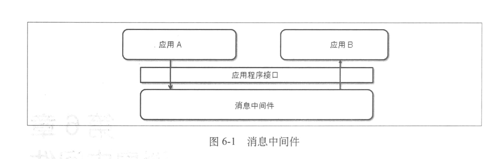
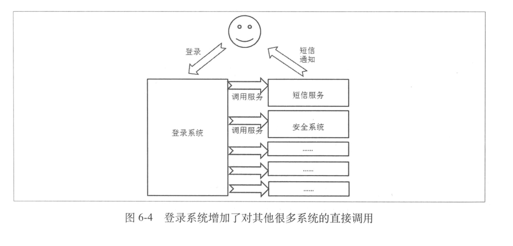
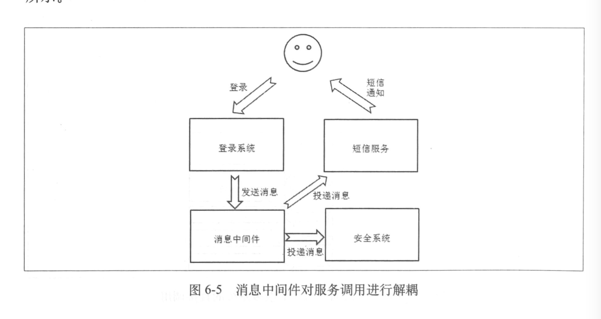
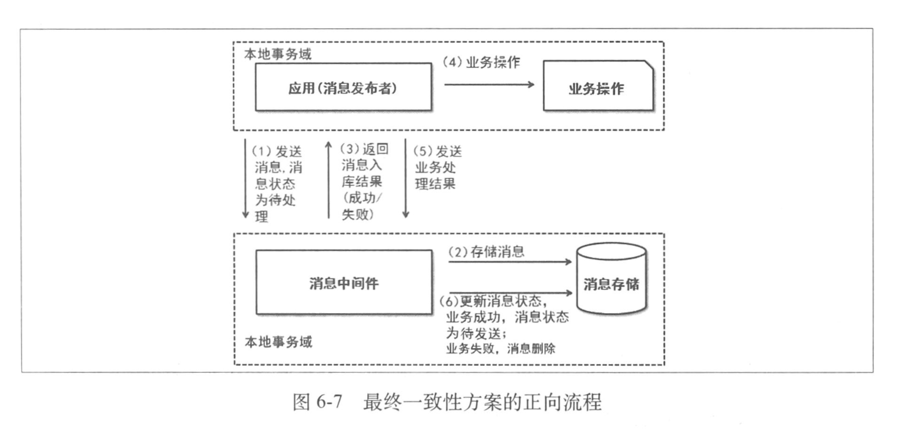
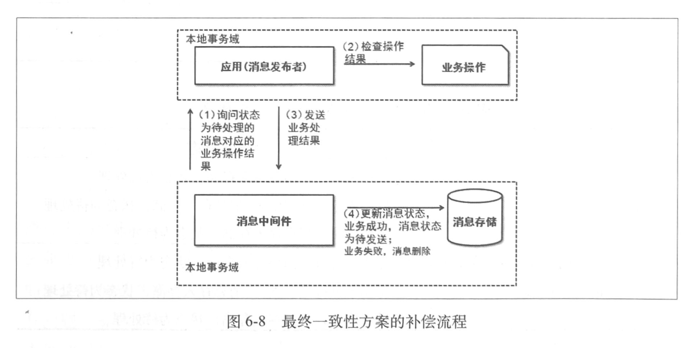

## 消息中间件

Message-oriented middleware(MOM) 消息中间件

消息中间件为我们带来了异步的特性，对系统进行了解耦



### 消息中间件对系统的解耦

在未引入消息中间件时，若用户登录时，需要发送一条短信，并且记录用户登录的信息（时间，ip等），系统如下




此时，每增加一个在登录成功后需要被调用的系统，就需要修改登录系统来进行相关的调用，登录系统被迫依赖非常多的系统

引入消息中间件解耦服务调用，如图所示，登录系统负责向消息中间件发送消息，而其他的系统向消息中间件来订阅这个消息，完成自己的工作。登录系统不用关心到底有多少个系统需要直到登录成功这件事，也不用关心如何通知它们，并且各个系统也是互不影响的。



### 解决消息发送一致性

消息发送一致是指产生消息的业务动作与消息发送的一致，也就是，如果业务操作成功了，那么由这个操作产生的消息一定要发送出去，否则就丢失消息了。另一方面，如果这个业务行为没有发生或者失败，那么就不应该把消息发送出去。

一个解决一致性的方案

1.发送消息给消息中间件

2.消息中间件入库消息

3.消息中间件返回结果

4.业务操作

5.发送业务操作结果给消息中间件

6.更改存储中消息状态

```java
Result postMessage(Message, PostMessageCallback) {
  	//发送消息给消息中间件
  	//获取返回结果
  	//如果失败，返回失败
  	//进行业务操作
  	//获取业务操作结果
  	//发送业务操作结果给消息中间件
  	//返回处理结果
}
```



若其中有流程出错了，消息中间件进行反向轮询



### 解决消息中间件与使用者的强依赖问题

1.提高消息中间件系统的可靠性，但是没有办法保证百分之百的可靠

2.对于消息中间件系统中影响业务操作进行的部分，使其可靠性与业务自身的可靠性相同

3.可以提供弱依赖的支持，能够较好地保证一致性

主要是从业务数据上进行消息补发，这才是最彻底的容灾手段


