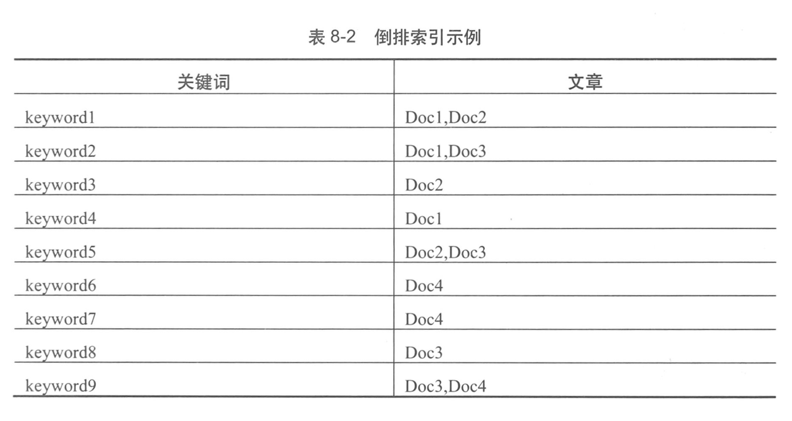

## 构建大型网站的其他要素

### 加速静态内容访问速度的CDN

CDN，Content Delivery Network 内容分发网络

### 大型网站的存储支持

#### 1 分布式文件系统

如淘宝的TFS，Google的GFS(Google File System)，GFS由三部分构成，GFS Client（客户端），GFS Master（在有些系统中被称为Namenode），GFS chunkserver（在有些系统被称为DataNode）

Client，应用使用GFS的入口，Client负责从GFS Master上获取要操作的文件在ChunkServer中的具体地址，然后直接和ChunkServer通信，获取数据或进行数据的写入，更新

Master，可以说是整个系统的大脑，这里维护了所有文件系统元数据，包括名字空间，访问控制信息，文件于Chunk（数据块）的映射信息，Chunk的当前位置等。Master也控制整个系统范围内的一些活动，例如无效Chunk的回收，ChunkServer之前Chunk的迁移。Master与ChunkServer之间通过周期性的心跳进行通信，检查对方是否在线

ChunkServer，这时文件数据存储的地方，在每个ChunkServer上会用Chunk（数据块）的方式来管理数据，每个Chunk是固定大小的文件，超过Chunk大小的文件会被分为多个Chunk进行存储，而对于小于Chunk大小的文件，则将会多个文件保存在一个Chunk中

GFS主要解决了单机文件存储容量及安全性的问题。开源系统中也有类似GFS的实现，例如HDFS就是采用Java的类GFS的实现。

#### 2 NoSQL

NoSQL涵盖范围很广，基本上处于分布式文件系统和SQL关系型数据库之间的系统都被归为NoSQL的范畴。

#### 3 缓存系统

缓存系统是非持久的存储，为了加速应用对数据的读取

### 搜索系统

站内搜索，当数据量和访问量很小时，一些数据的查询可以直接用数据库的Like操作来实现，当然这种效率很低。当网站的访问量和数据量增大时，就需要在站内使用搜索技术来解决信息查找的问题。

#### 倒排索引

相对于正排索引，倒排索引是把原来作为值的内容拆分为索引的Key，而原来用作索引的Key则变成了值。搜索引擎比数据库的Like更高效的原因也在于倒排索引。

如何确定建立倒排索引的关键字，主要取决于如何对要索引的内容进行分词

#### 查询预处理

查询预处理主要负责对用户输入的内容进行分词及分词后的分析，包括一些同义词的替换及纠错。

### 数据计算支撑

离线计算，是业务产生的数据离开生产环境后进行的计算，就是把业务数据从在线存储中移动到离线存储中，然后进行数据处理的过程。从时效性来说，计算结果和产生数据的时刻相比会有较大的延迟。

离线计算领域中，MapReduce模型非常著名和常用，在Map阶段，文明根据设定的规则把整体数据集映射给不同的Worker来处理，并且生成各自的处理结果。而在Reduce阶段，是对前面处理过的数据进行聚合，形成最后的结果。当然，一个任务的处理可能不止一次MapReduce过程。

Hadoop是MapReduce的一个开源实现，Hadoop使用HDFS进行数据存储，而Spark则提供了基于内存的集群计算的支持。

在线计算，在线计算是比较实时的计算，其中比较常见的方式是流式计算。其中Storm是使用比较广泛的一个框架

### 发布系统

1.分发应用，使用发布服务器加快发布

2.启动校验

3.灰度发布

4.产品改版Beta

### 应用监控系统

数据监视维度，系统环境信息和应用自身的数据

数据记录方式，记录到自身目录中，发送到采集服务器上

数据采集方式，有应用服务器主动推给监控中心和等待监控中心来拉去两种方式。

展现与警告

### 依赖管理系统

Google在2010年发布的论文Dapper，介绍了在大型分布式系统中的追踪，从进入到大型分布式系统中的一个请求开始，追踪这个请求在整个大型分布式系统中的调用情况，帮助绘制一个分布式系统中跨系统的时序图。