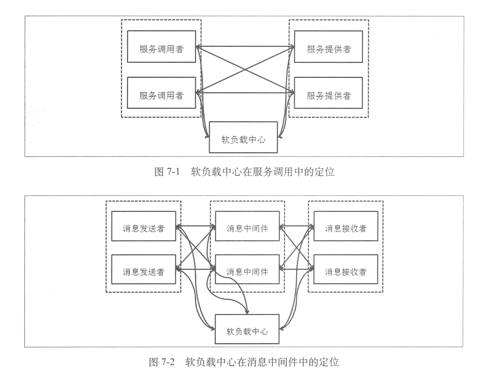
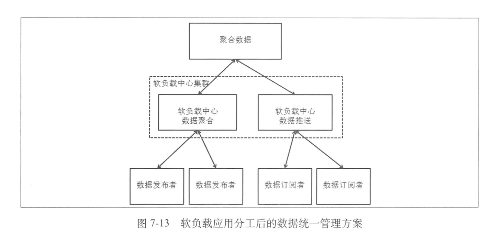

## 软负载中心与集中配置管理

软负载中心有两个最基础的职责

一、聚合地址信息。无论是服务框架中需要用到的服务提供者地址，还是消息中间件系统中消息中间件应用的地址，都需要由软负载中心去聚合地址列表，形成一个可供服务调用者及消息的发送者，接收者直接使用的列表

二、生命周期感知。软负载中心需要能对服务器的上下线自动感知，根据这个变化去更新服务地址数据，形成新的地址列表后，把数据传给需要数据的调用者或者消息的发送者和接收者。

### 软负载中心的结构

软负载中心包括两部分，一是软负载中心的服务端，另一个是软负载中心的客户端。服务端主要负责感知提供服务的机器是否在线，聚合提供者的机器信息，并且负责把数据传给使用数据的应用。客户端承载了两个角色，作为服务提供者，客户端主要是把服务提供者提供服务的具体信息主动传给服务端，并且随着服务的变化去更新数据。而作为服务使用者，客户端主要是向服务端告知自己所需要的数据并负责去更新数据，还要进行本地的数据缓存，通过本地的数据缓存，使得每次去请求服务获取列表都是一个本地操作，从而提升效率和性能。

软负载中心内部由三部分重要的数据

-   聚合数据，聚合后的地址信息列表
-   订阅关系，数据的应用（服务使用者等）把自己需要的数据信息告诉软负载中心，这时一个订阅的关系
-   连接数据，是指连接到软负载中心的节点和软负载中心已经建立的连接管理。

### 内容聚合功能的设计

在内容聚合部分需要完成的主要是两个

一、保证数据的正确性，主要保证的是并发场景下的数据聚合的正确性，另外需要考虑的是发布数据的机器短时间上下线的问题。主要是在这些异常或者较为复杂的场景下保证数据的正确性

二、高效聚合数据

### 解决服务上下线的感知

一、通过客户端与服务端的连接感知

无论是数据的发布者还是接受者都与软负载中心的服务器维持一个长连接。对于服务提供者来说，软负载中心可以通过这个长连接上的心跳或者数据的发布来判断服务发布者是否还在线。但是当软负载中心自身的负载很高时，可能产生误判，如心跳来不及处理。

二、通过对于发布数据中提供的地址端口进行连接的检查。

通过外部的一个主动检查的方式去判定是一个补偿的方式，也就是通过长连接的相关感知判断服务应用已经下线时，不直接认定这个服务已经下线，而是交给另一个独立的监控应用去验证这个服务是否已经不在了。

### 提升数据分发性能需要注意的问题

-   数据压缩
-   全量与增量的选择

### 从单机到集群

软负载中心从单机走向集群，需要解决两方面的问题

一、数据管理问题，软负载中心聚合了整个分布式集群中的服务地址信息，在单机的情况下，这些数据都统一地存在着歌软负载中心机器上，那么变为集群时，数据该如何维护？

二、连接管理问题，在单机时，所有的数据发布者和数据订阅者都会连接到这台软负载中心的机器上，而从单机到集群时，这些数据发布者和数据订阅者的连接该如何管理

### 数据统一管理方案

整个结构分为三层，聚合数据这一层就是在管理数据。而软负载中心的机器则是无状态的，不再管理数据。对于数据发布者和订阅者来说，选择软负载中心集群中的任何一个机器连接皆可。而且负载中心集群中的机器职责可以分开，如上图。可以让集群中应用分工更加明确。

### 数据对等管理方案

另一种方案是分散在各个软负载中心的节点上。在软负载中心集群内部，各个节点之间会进行数据的同步。但是这种方式下，比较难实现 ，而且设计到同步效率问题

### 长轮询

长轮询建立连接并且发送请求后，如果有数据，那么长轮询和普通轮询会立刻返回。如果没有数据，长轮询会等待，如果等到数据，那么就立刻返回，如果一直没有数据，则等到超时后返回，继续建立连接，而普通轮询就直接返回了。

长轮询的方式，数据分发的实时性比普通轮询要好很多，和Socket长连接方式大体相同，不过长轮询需要不断地建立连接，这是它相对于Socket长连接方式的弱点。可以说HTTP长轮询方式是HTTP普通轮询和Socket长连接方式的折中。

